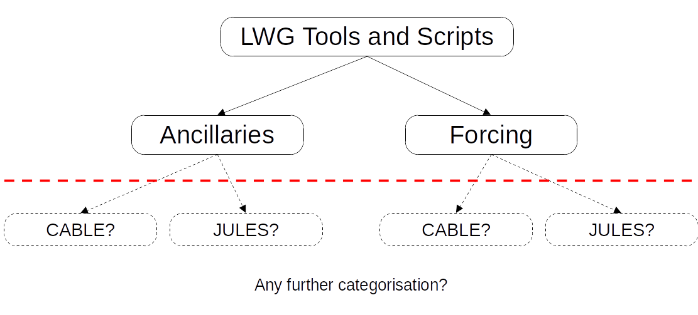

# About

This repository is intended to store, where appropriate, the many scripts and tools used by the land community within Australia as part of their research for ancillary data creation. This includes processes such as re-gridding, aggregation and disaggregation, statistical analyses and reductions, resampling, reformatting of datasets for ingestion by either CABLE or JULES.
The goal is to use these community-shared resources to converge towards a shared infrastructure to create ancillary data.

This repository was first created for the working bee day at the 2024 Land Surface Model Working Group workshop.

# Why

Many groups within the land community are using similar workflows and have similar requirements. By collecting and cataloguing the tools created by the community in one place, we achieve the following objectives:

* Reduce duplicated work by reusing existing functionality
* Ensure comparability between scientific runs made by different groups by using unified methods of interpolation, aggregation etc.
* Results are reproducible, as we have a history of any changes made to the tools

# What to do

Place your script or tool in the relevant directory within the repository and include a README. The README should be named according to the name of your script e.g. if your script is called ```interpolate_met_data.py```, then your README should be named ```interpolate_met_data_README.txt```.

## Contents of the README

The README should have three headings: __Purpose__, __Usage__, __Method__. Please be verbose in the descriptions. For example:

### Purpose
__BAD__: Interpolates met data

__GOOD__: Interpolates the CRU-JRA met data to the desired resolution and writes the output to NetCDF in a format readable by CABLE.

### Usage
__BAD__: interpolate_met_data.py -r lat_resolution,lon_resolution -o output.nc -b lat_min,lat_max,lon_min,lon_max

__GOOD__: Call from the command line via ```interpolate_met_data.py -r lat_resolution,lon_resolution -o output.nc -b lat_min,lat_max,lon_min,lon_max```, where:
* "-r lat_resolution,lon_resolution" are the grid spacings (required).
* "-o output.nc" specifies the name of the output file to write to (required).
* "-b lat_min,lat_max,lon_min,lon_max" specify the domain to interpolate (optional). If no bounds are specified, then the original domain is used.

### Method
__BAD__: uses linear interpolation

__GOOD__: Reads the dataset using [xarray](https://docs.xarray.dev/en/stable/) and uses scipy's [LinearNDInterpolator](https://docs.scipy.org/doc/scipy/reference/generated/scipy.interpolate.LinearNDInterpolator.html#scipy.interpolate.LinearNDInterpolator) to perform the interpolation.

## Repository Structure

The repository is currently structured to reflect the categories set on the working day i.e. ancillaries and meteorological forcing. The structure for this repository (or it's successor) will be open to discussion.


